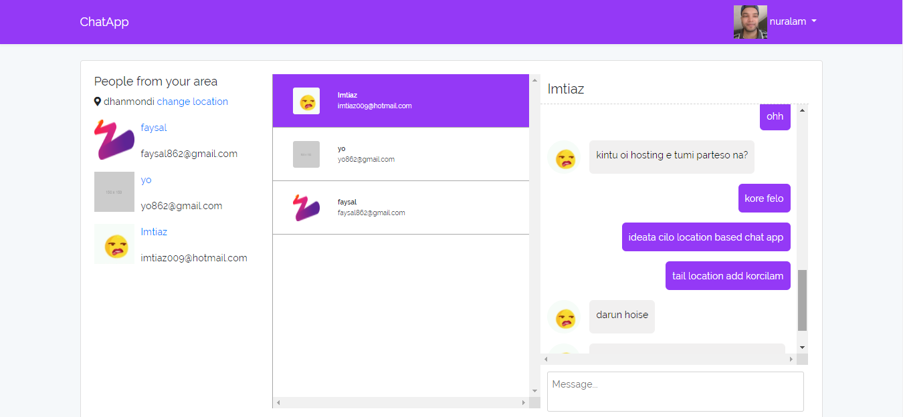

<!-- Headings -->

> It was multi user real-time chat application. 
> > For WebSocket implementation I used **pusher api**. Others are **laravel 5.6**, **vue js**.

----
# chat home page

#login page

#registration page

